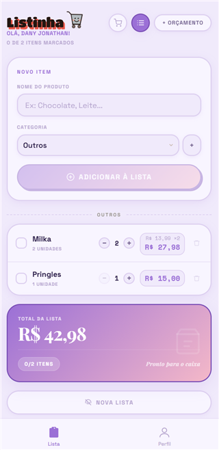
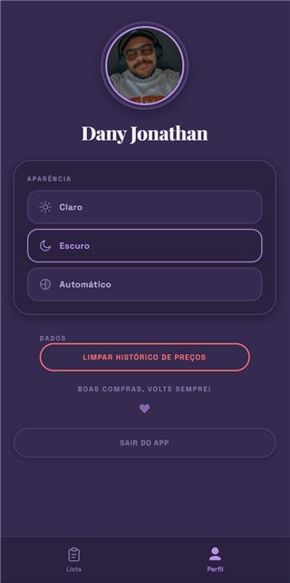

<h1>
   Listinha
</h1>

Lista de compras para o celular. Sem papel, sem perder no fundo da bolsa, sem esquecer em casa.

**Demo:** https://lista-de-compras-dany.vercel.app

---

## A ideia

Comecei a fazer esse app pra resolver um problema meu mesmo: eu sempre esquecia a lista de compras em casa ou perdia o papelzinho no meio do mercado. Comentei isso com umas amigas e descobri que elas viviam reclamando da mesma coisa — sempre no papel, sempre perdendo, sempre esquecendo.

Aí resolvi juntar as duas coisas: uma desculpa boa pra programar algo do zero e uma solução real pra um problema que várias pessoas próximas de mim tinham. Nasceu o Listinha — simples o bastante pra qualquer uma delas usar sem pensar duas vezes, e completo o bastante pra realmente substituir o papel.

---

## Telas

<div align="center">
  
  &nbsp;
  
  &nbsp;
  
</div>

---

## O que dá pra fazer

- **Montar a lista** por nome e categoria, já organizada por grupo (hortifruti, limpeza, laticínios...)
- **Definir quantidade e preço** de cada item, com o total calculado na hora
- **Acompanhar o orçamento** — o app avisa quanto já foi gasto e quanto ainda sobra
- **Marcar no modo de compra**, separando o que já foi pego do que ainda falta
- **Lembrar o último preço** de cada produto, sugerindo o valor da próxima vez
- **Trocar o tema** entre claro, escuro ou automático (segue o horário do dia)
- **Entrar com a conta Google**, sem senha pra criar ou lembrar

---

## Como foi construído

O projeto é dividido em duas partes que conversam por uma API:

- **Frontend em React**, hospedado na Vercel — é o que você usa no celular
- **Backend em Python (Flask)**, propositalmente simples e comentado — só ele fala com o banco de dados
- **Firebase** cuidando do login (Google) e do banco (Firestore), então a lista te acompanha em qualquer aparelho

Fiz questão de manter o backend enxuto e bem comentado — é também o material que uso pra estudar e ensinar como uma API do zero funciona, sem framework escondendo a lógica.

---

## Stack

| Camada | Tecnologia |
|---|---|
| Frontend | React 19 + Vite |
| Roteamento | React Router (HashRouter) |
| Estilização | CSS Modules |
| Backend | Python + Flask |
| Login | Firebase Auth (Google) |
| Banco de dados | Firestore |
| Deploy | Vercel (frontend) |

---

## Rodando localmente

O projeto tem duas partes: **backend** (Flask) e **frontend** (React). O passo a passo completo de configuração do Firebase (criar projeto, ativar login, gerar chaves) está em [`backend/README.md`](backend/README.md).

```bash
git clone https://github.com/Danyyks/lista-de-compras
cd lista-de-compras

# Backend
cd backend
pip install -r requirements.txt
python app.py          # http://localhost:5000

# Frontend (em outro terminal, na raiz do projeto)
npm install
npm run dev             # http://localhost:5173
```

---

Feito por Dany Jonathan Bueno, pra mim e pras minhas amigas — se ajudar mais alguém pelo caminho, melhor ainda.
