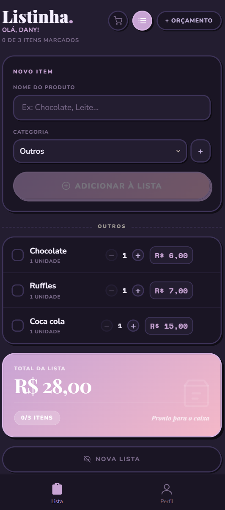

# Listinha

Esqueça o papel e a caneta. O Listinha é um aplicativo de lista de compras para o seu celular — simples, rápido e sempre na palma da mão.

Você monta a lista antes de sair de casa, marca os produtos conforme pega no carrinho e acompanha o gasto em tempo real. Sem contas, sem cadastro, sem internet. Tudo fica salvo direto no seu dispositivo.

<br>

<div align="center">
  
  &nbsp;&nbsp;&nbsp;
  
</div>

<br>

## O que você pode fazer

**Montar a lista**
Adicione produtos por nome e escolha a categoria. Os itens ficam organizados automaticamente por grupo — hortifruti, laticínios, limpeza, e por aí vai.

**Controlar quantidade e preço**
Defina quantas unidades quer de cada item e qual o preço. O app soma tudo e mostra o total da lista em tempo real.

**Definir um orçamento**
Defina quanto quer gastar. O app mostra se você está dentro ou fora do limite conforme vai adicionando produtos.

**Usar no mercado**
Marque os itens conforme coloca no carrinho. O modo de compra mostra qual produto pegar a seguir, em ordem, para você não precisar ficar olhando a lista toda hora.

**Lembrar os preços**
O app registra o último preço de cada produto. Na próxima vez que você adicionar o mesmo item, ele já sugere o valor automaticamente.

**Escolher a aparência**
Tema claro, escuro ou automático — no modo automático, o app muda sozinho dependendo do horário do dia.

<br>

## Como acessar

O app roda direto no navegador do celular, sem precisar baixar nada.

Para instalar como aplicativo na tela inicial, abra o link no navegador do seu celular e toque em **"Adicionar à tela inicial"** — disponível tanto no iPhone quanto no Android.

<br>

## Rodar localmente

Você precisa ter o [Node.js](https://nodejs.org) instalado.

```bash
npm install
npm run dev
```

O app abre em `http://localhost:5173`.

Para gerar a versão de produção:

```bash
npm run build
```

<br>

## Tecnologias

- React 19 e Vite 6
- React Router com suporte a GitHub Pages e Vercel
- CSS Modules para estilização por componente
- localStorage para persistência local, sem backend
